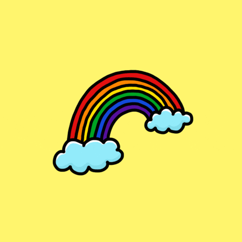

### 	:pirate_flag: :crossed_flags: :checkered_flag:

## I'm a Developer , student , and wanna be a hacker

-:green_square: I'm a student of computer science

-:orange_square: I'm a developer web and android

-:blue_square: I'm a tech enthusiast

-:atom_symbol: Funfact: I would love to marry js

-:peace_symbol: bonus: also i love to sketch ugly things

-:pirate_flag: Blazing fast learning

## Languages and Frameworks
-:euro: javascript, python

-:money_with_wings: html5, css3

-:dollar: React, Vue

-:coin: Golang, Nodejs, experss

-:credit_card: MongoDB, Postgresql

-:pound: C++

 
 

## :telephone_receiver: me

[twitter]: https://twitter.com/crypticcc101

[github]: https://github.com/zwn28

-:github: : 'https://zwn28.github.io/'

-:email: : crypticcc101@gmail.com

